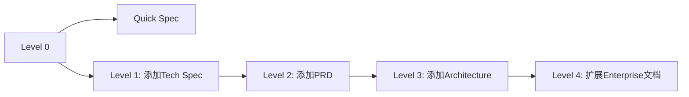

# Scale-Adaptive System 深度解析

## 概述

Scale-Adaptive System（规模自适应系统）是BMAD-METHOD的核心创新，它能够根据项目复杂度自动调整规划深度，避免过度设计和规划不足的问题。

## 核心原理

### Level分层体系

```yaml
Level 0: "Single Atomic Change" (1个story)
  关键词: ["fix", "bug", "typo", "patch"]
  文档要求: 最小化 - 仅tech spec
  架构需求: 不需要
  典型场景: Bug修复、小改动

Level 1: "Small Feature" (1-10个stories)
  关键词: ["simple", "basic", "small feature", "add"]
  文档要求: Tech spec
  架构需求: 不需要
  典型场景: 简单功能添加

Level 2: "Medium Project" (5-15个stories)
  关键词: ["dashboard", "admin panel", "several features"]
  文档要求: PRD + 可选tech spec
  架构需求: 可选
  典型场景: 多功能项目

Level 3: "Complex System" (12-40个stories)
  关键词: ["platform", "integration", "complex", "system"]
  文档要求: PRD + 架构 + JIT tech specs
  架构需求: 必需
  典型场景: 复杂系统集成

Level 4: "Enterprise Scale" (40+个stories)
  关键词: ["enterprise", "multi-tenant", "ecosystem"]
  文档要求: PRD + 架构 + JIT tech specs
  架构需求: 必需
  典型场景: 企业级多产品
```

## 检测机制

### 1. 关键词检测

系统通过分析用户输入的项目描述，匹配预定义的关键词来初步判断level：

```javascript
// 伪代码示例
const detection_hints = {
  keywords: {
    level_0: ["fix", "bug", "typo", "small change", "quick update", "patch"],
    level_1: ["simple", "basic", "small feature", "add", "minor"],
    level_2: ["dashboard", "several features", "admin panel", "medium"],
    level_3: ["platform", "integration", "complex", "system", "architecture"],
    level_4: ["enterprise", "multi-tenant", "multiple products", "ecosystem", "scale"]
  }
}

function detectLevel(description) {
  const words = description.toLowerCase().split(' ');
  let scores = {0: 0, 1: 0, 2: 0, 3: 0, 4: 0};

  for (let word of words) {
    for (let level in detection_hints.keywords) {
      if (detection_hints.keywords[level].includes(word)) {
        scores[level]++;
      }
    }
  }

  return getHighestScore(scores);
}
```

### 2. Story数量估算

```yaml
story_counts:
  level_0: [1, 1]      # 精确1个story
  level_1: [1, 10]     # 1-10个stories
  level_2: [5, 15]     # 5-15个stories (与Level1有重叠)
  level_3: [12, 40]    # 12-40个stories (与Level2有重叠)
  level_4: [40, 999]   # 40+个stories
```

**重叠区间的设计意图**:
- 5-10个stories: Level1或Level2都可能，取决于功能复杂度
- 12-15个stories: Level2或Level3都可能，取决于是否需要架构设计

### 3. 用户确认机制

系统不会强制执行检测结果，而是：
1. 提供建议level和理由
2. 让用户确认或override
3. 支持运行时升级level

```bash
# 典型交互流程
$ bmad workflow-init "添加用户评论系统"

🎯 项目分析结果:
检测到: "用户", "评论", "系统"
预估Stories: 8-12个
建议Level: Level 2 (Medium Project)

理由:
✓ 涉及多个功能模块 (评论CRUD + 展示 + 管理)
✓ 需要前后端协调
✓ 无复杂第三方集成

确认使用 Level 2? [Y/n/1/3]: Y
```

## 自适应调整机制

### 1. 运行时升级

```yaml
升级路径:
  Level 0 → Level 1: 添加tech spec
  Level 1 → Level 2: 运行create-prd添加PRD
  Level 2 → Level 3: 运行create-architecture添加架构
  Level 3 → Level 4: 扩展架构和文档范围
```

### 2. 文档增量生成



### 3. Gate检查机制

每个level都有对应的gate检查，确保文档完整性：

```yaml
Level 2 Gate检查:
  ✅ PRD已创建且完整
  ✅ Epics和Stories已定义
  ✅ (可选) Architecture已设计
  ✅ Implementation Readiness通过

Level 3 Gate检查:
  ✅ PRD已创建且完整
  ✅ Architecture已设计且详细
  ✅ Epics和Stories已定义
  ✅ 技术依赖已确认
  ✅ Implementation Readiness通过
```

## 实际应用案例

### 案例1: Bug修复 (Level 0)

```yaml
输入: "修复登录页面的验证码显示问题"
检测结果:
  关键词匹配: "修复" → Level 0
  Story数量: 1个
  推荐Level: 0

工作流:
  1. 快速问题描述
  2. 直接实现
  3. 无需额外文档
```

### 案例2: 功能添加 (Level 1→2升级)

```yaml
初始输入: "添加用户头像上传功能"
初始检测: Level 1 (简单功能)

实施过程中发现:
  - 需要图片处理服务
  - 需要CDN集成
  - 需要权限管理
  - 涉及多个页面修改

用户决策: 升级到Level 2
执行: 运行create-prd补充产品需求文档
```

### 案例3: 复杂系统 (Level 3)

```yaml
输入: "构建微服务架构的订单管理平台"
检测结果:
  关键词匹配: "平台", "架构" → Level 3
  Story数量: 25-35个估算
  推荐Level: 3

必需文档:
  ✅ PRD (产品需求)
  ✅ Architecture (系统架构)
  ✅ Epics & Stories
  ✅ JIT Tech Specs (按需)
```

## 技术实现细节

### 配置文件结构

```yaml
# src/modules/bmm/workflows/workflow-status/project-levels.yaml
levels:
  2:
    name: "Level 2"
    title: "Medium Project"
    stories: "5-15 stories"
    description: "Multiple features, focused PRD"
    documentation: "PRD + optional tech spec"
    architecture: false

detection_hints:
  keywords:
    level_2: ["dashboard", "several features", "admin panel", "medium"]
  story_counts:
    level_2: [5, 15]
```

### 检测算法

```javascript
// tools/lib/level-detector.js (伪代码)
class LevelDetector {
  detectLevel(projectDescription, estimatedStories) {
    const keywordScore = this.calculateKeywordScore(projectDescription);
    const storyScore = this.calculateStoryScore(estimatedStories);
    const combinedScore = this.combineScores(keywordScore, storyScore);

    return {
      suggestedLevel: this.getHighestScoringLevel(combinedScore),
      confidence: this.calculateConfidence(combinedScore),
      reasoning: this.generateReasoning(keywordScore, storyScore)
    };
  }

  calculateKeywordScore(description) {
    // 关键词匹配算法
  }

  calculateStoryScore(stories) {
    // Story数量区间匹配
  }
}
```

## 优势与价值

### 1. 避免过度设计

**传统问题**: 小项目也要写完整的架构文档
**Scale-Adaptive解决方案**: Level 0-1项目跳过架构，直接实现

### 2. 避免规划不足

**传统问题**: 复杂项目缺乏充分规划导致返工
**Scale-Adaptive解决方案**: Level 3-4强制要求架构设计

### 3. 渐进式规划

**传统问题**: 项目开始时难以准确估算复杂度
**Scale-Adaptive解决方案**: 支持运行时升级，从简单开始

### 4. 标准化流程

**传统问题**: 不同规模项目使用相同流程效率低
**Scale-Adaptive解决方案**: 为每个level定制最适合的流程

## 局限性与改进空间

### 当前局限性

1. **关键词依赖**: 检测算法依赖预定义关键词，可能遗漏新场景
2. **文化差异**: 关键词基于英文环境，中文环境可能需要调整
3. **领域特化**: 不同行业的复杂度标准可能不同

### 改进方向

1. **机器学习增强**: 使用历史数据训练更准确的检测模型
2. **动态阈值**: 根据团队历史表现动态调整level阈值
3. **领域定制**: 为不同行业提供定制化的level定义

## 总结

Scale-Adaptive System是BMAD-METHOD的核心创新，它通过智能检测和渐进式规划，实现了"恰到好处"的项目管理。这种设计既保证了小项目的敏捷性，又确保了大项目的规范性，是对传统"一刀切"项目管理方法的重要突破。