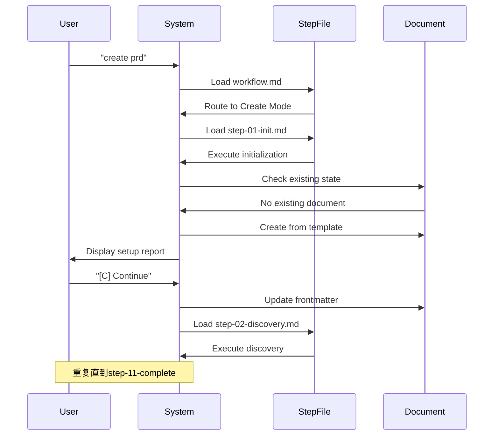
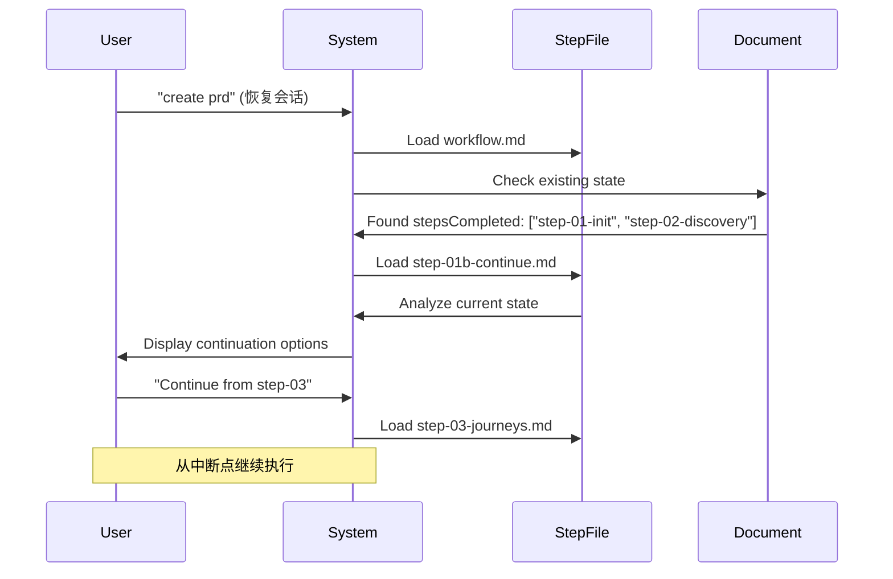

# Step-File Architecture 架构分析

## 概述

Step-File Architecture（步骤文件架构）是BMAD-METHOD的独特工作流执行模式，它通过微文件设计实现了严格的顺序执行、状态持久化和可恢复性。这与传统的reAct模式形成鲜明对比。

## 核心设计理念

### 1. 微文件设计 (Micro-file Design)

```
workflow.md (主入口)
├── steps-c/ (Create模式)
│   ├── step-01-init.md
│   ├── step-02-discovery.md
│   ├── step-03-journeys.md
│   ├── ...
│   └── step-11-complete.md
├── steps-v/ (Validate模式)
│   ├── step-v-01-discovery.md
│   ├── step-v-02-analysis.md
│   └── ...
└── steps-e/ (Edit模式)
    ├── step-e-01-discovery.md
    ├── step-e-02-improvement.md
    └── ...
```

**设计原则**:
- 每个步骤是独立的markdown文件
- 包含完整的执行指令和规则
- 自包含，不依赖其他步骤的内存状态

### 2. 与reAct模式的对比

| 特性 | Step-File Architecture | reAct |
|------|----------------------|--------|
| **执行模式** | 严格顺序，步骤驱动 | 循环推理-行动 |
| **状态管理** | 持久化到文档frontmatter | 内存中临时状态 |
| **可恢复性** | 任意步骤可恢复 | 需要重新开始 |
| **用户控制** | 每步等待用户确认 | 自动化执行 |
| **审计性** | 完整执行轨迹记录 | 难以追踪决策过程 |
| **并行性** | 串行执行 | 可能并行推理 |
| **错误处理** | 步骤级回滚 | 整体重试 |

## 技术实现机制

### 1. 步骤文件结构

```markdown
---
name: 'step-01-init'
description: 'Initialize the PRD workflow'
nextStepFile: './step-02-discovery.md'
continueStepFile: './step-01b-continue.md'
outputFile: '{planning_artifacts}/prd.md'
prdTemplate: '../templates/prd-template.md'
---

# Step 1: Workflow Initialization

**Progress: Step 1 of 11** - Next: Project Discovery

## STEP GOAL:
初始化PRD工作流，检测继续状态，设置文档结构

## MANDATORY EXECUTION RULES:
- 🛑 NEVER 生成内容而不等待用户输入
- 📖 CRITICAL: 执行前读取完整步骤文件
- 🔄 CRITICAL: 加载下一步时确保读取完整文件
- 📋 你是引导者，不是内容生成器

## Sequence of Instructions (不可偏离、跳过或优化)

### 1. Check for Existing Workflow State
检查输出文档是否已存在...

### 2. Handle Continuation (If Document Exists)
如果文档存在且有frontmatter...

### 3. Fresh Workflow Setup (If No Document)
如果没有文档或frontmatter...

### 4. Present MENU OPTIONS
显示菜单选项:
"[C] Continue - 保存并移动到项目发现 (Step 2 of 11)"
```

### 2. 执行规则系统

#### Universal Rules (通用规则)

```yaml
🛑 NEVER: 在没有用户输入时生成内容
📖 CRITICAL: 执行前读取完整步骤文件
🔄 CRITICAL: 使用'C'加载下一步时确保读取完整文件
📋 角色定位: 引导者，不是内容生成器
✅ 语言要求: 使用配置的communication_language
```

#### Step-Specific Rules (步骤特定规则)

```yaml
🎯 专注: 仅关注当前步骤目标
🚫 禁止: 查看未来步骤或假设其知识
💬 方法: 系统化设置，向用户清晰报告
🚪 状态检测: 检测现有工作流状态并正确处理继续
```

#### Execution Protocols (执行协议)

```yaml
🎯 分析: 执行前显示当前状态分析
💾 初始化: 初始化文档结构并适当更新frontmatter
📝 状态更新: 将步骤名添加到stepsCompleted数组末尾
🚫 禁止: 用户选择'C'前不得加载下一步
```

### 3. 状态持久化机制

#### Frontmatter状态跟踪

```yaml
---
# 文档frontmatter示例
project_name: "电商评论系统"
created_date: "2026-01-13"
last_updated: "2026-01-13T10:30:00Z"
workflow_version: "prd-v2.1"

# 执行状态
stepsCompleted:
  - "step-01-init"
  - "step-02-discovery"
  - "step-03-journeys"

# 输入文档追踪
inputDocuments:
  - "/path/to/product-brief.md"
  - "/path/to/user-research.md"

# 统计信息
documentCounts:
  briefCount: 1
  researchCount: 2
  brainstormingCount: 0
  projectDocsCount: 3
---

# PRD文档内容开始...
```

#### 状态检测逻辑

```javascript
// 伪代码：状态检测逻辑
function detectWorkflowState(outputFile) {
  if (!fileExists(outputFile)) {
    return { state: 'fresh', action: 'initialize' };
  }

  const frontmatter = parseFrontmatter(outputFile);
  const stepsCompleted = frontmatter.stepsCompleted || [];

  if (stepsCompleted.includes('step-11-complete')) {
    return { state: 'completed', action: 'show_summary' };
  }

  if (stepsCompleted.length > 0) {
    return {
      state: 'continuation',
      action: 'load_continue_step',
      lastStep: stepsCompleted[stepsCompleted.length - 1]
    };
  }

  return { state: 'incomplete', action: 'restart' };
}
```

## 工作流模式系统

### 1. 三模态设计

每个workflow支持三种执行模式：

```yaml
Create Mode (创建模式):
  触发: "create prd", "new prd", "-c"
  路径: steps-c/
  目标: 从零开始创建新文档

Validate Mode (验证模式):
  触发: "validate prd", "check prd", "-v"
  路径: steps-v/
  目标: 验证现有文档质量

Edit Mode (编辑模式):
  触发: "edit prd", "improve prd", "-e"
  路径: steps-e/
  目标: 改进现有文档
```

### 2. 模式路由机制

```markdown
## MODE DETERMINATION

### Detect Workflow Mode

1. **Command/Invocation:**
   - "create prd" or "new prd" → Create mode
   - "validate prd" or "check prd" → Validate mode
   - "edit prd" or "improve prd" → Edit mode

2. **Context Detection:**
   - 如果使用 -c flag → Create mode
   - 如果使用 -v flag → Validate mode
   - 如果使用 -e flag → Edit mode

3. **Menu Selection (if unclear):**
   如果无法确定模式，显示选择菜单

### Route to Appropriate Workflow

**IF Create Mode:**
Load, read entire file, then execute: `{nextStep}`

**IF Validate Mode:**
Prompt for PRD path, then execute: `{validateWorkflow}`

**IF Edit Mode:**
Prompt for PRD path, then execute: `{editWorkflow}`
```

## 执行控制机制

### 1. 菜单系统

```markdown
# 典型菜单结构
"[C] Continue - 保存并移动到下一步 (Step X of 11)"

# 菜单处理逻辑
- IF C: 更新frontmatter，加载下一步骤文件并执行
- IF 用户提供额外文件: 加载文件，更新inputDocuments，重新显示报告
- IF 用户提问: 回答问题并重新显示菜单
```

### 2. 继续协议 (Continuation Protocol)

```yaml
检测到现有文档且stepsCompleted存在但未完成:
  1. 立即停止当前初始化
  2. 加载continueStepFile
  3. 不继续任何初始化任务
  4. 让step-01b处理所有继续逻辑
  5. 这是自动进行的情况 - 无需用户选择
```

### 3. 错误处理与恢复

```yaml
错误场景处理:
  文档损坏: 重新从模板初始化
  步骤中断: 从最后完成的步骤继续
  用户取消: 保持当前状态，等待恢复
  系统异常: 回滚到上一个稳定状态
```

## 实际执行流程示例

### PRD创建工作流执行



### 中断恢复流程



## 优势与价值

### 1. 可恢复性 (Recoverability)

**传统问题**: 工作流中断后需要重新开始
**Step-File解决方案**: 状态持久化，任意点恢复

### 2. 审计性 (Auditability)

**传统问题**: 难以追踪决策过程和执行轨迹
**Step-File解决方案**: 每步都有记录，完整审计轨迹

### 3. 可预测性 (Predictability)

**传统问题**: AI行为不可预测，可能跳过重要步骤
**Step-File解决方案**: 严格顺序执行，确保完整性

### 4. 用户控制 (User Control)

**传统问题**: 自动化执行缺乏用户参与
**Step-File解决方案**: 每步等待确认，用户完全控制进度

### 5. 质量保证 (Quality Assurance)

**传统问题**: 缺乏标准化流程导致质量不一致
**Step-File解决方案**: 标准化步骤确保输出质量

## 局限性与改进空间

### 当前局限性

1. **执行效率**: 严格串行执行可能较慢
2. **灵活性**: 无法根据具体情况调整步骤顺序
3. **复杂性**: 步骤文件维护成本较高

### 改进方向

1. **智能跳过**: 在某些条件下允许跳过不必要的步骤
2. **并行执行**: 支持独立步骤的并行执行
3. **动态调整**: 根据项目特点动态调整步骤序列

## 总结

Step-File Architecture是BMAD-METHOD的重要创新，它通过微文件设计和严格的执行控制，实现了可恢复、可审计、可预测的工作流执行。虽然在灵活性方面有所牺牲，但在质量保证和用户控制方面提供了显著优势，特别适合需要高质量输出的复杂项目管理场景。