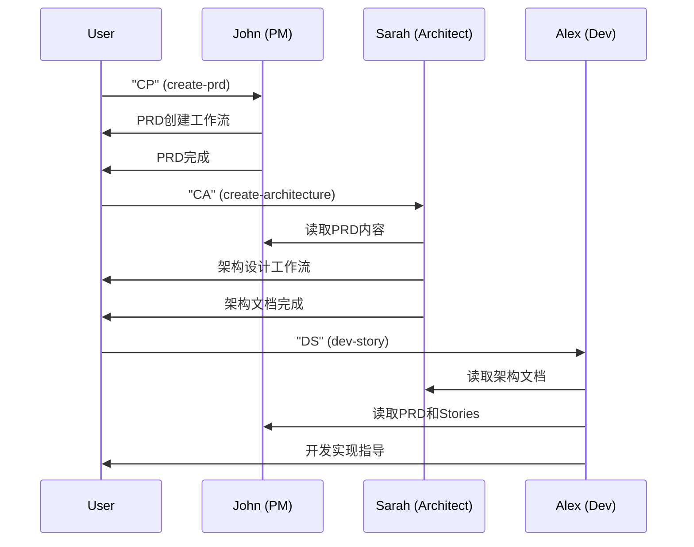

# Agent System Design 系统设计分析

## 概述

BMAD-METHOD的Agent系统是其人机协作的核心，通过21个人格化专业Agent实现了深度的角色分工和协作。每个Agent都有独特的专业背景、沟通风格和工作方式。

## Agent架构设计

### 1. Agent定义结构

```yaml
agent:
  metadata:
    id: "_bmad/bmm/agents/pm.md"        # 唯一标识符
    name: "John"                        # 人格化名字
    title: "Product Manager"            # 职位角色
    icon: "📋"                         # 视觉标识
    module: "bmm"                      # 所属模块
    hasSidecar: false                  # 是否有辅助文件

  persona:
    role: "Product Manager specializing in..."              # 角色定义
    identity: "8+ years launching B2B products..."          # 身份背景
    communication_style: "Asks 'WHY?' relentlessly..."      # 沟通风格
    principles: |                                            # 工作原则
      - Channel expert PM thinking
      - PRDs emerge from user interviews
      - Ship smallest thing that validates

  critical_actions:                    # 关键初始化动作
    - "Load project config"
    - "Remember user name"

  menu:                               # 功能菜单
    - trigger: "CP or fuzzy match on create-prd"
      exec: "{project-root}/_bmad/bmm/workflows/..."
      description: "[CP] Create Product Requirements Document"

  prompts:                            # 可选预定义提示
    - id: "discovery_questions"
      content: "What problem are we solving?"

  discussion: true                    # 是否支持对话模式
  conversational_knowledge: []        # 对话知识库
```

### 2. Schema验证系统

BMAD-METHOD使用严格的Zod schema验证Agent定义：

```javascript
// tools/schema/agent.js 核心验证逻辑
const agentSchema = z.object({
  agent: z.object({
    metadata: buildMetadataSchema(),
    persona: buildPersonaSchema(),
    critical_actions: z.array(createNonEmptyString()).optional(),
    menu: z.array(buildMenuItemSchema()).min(1),
    prompts: z.array(buildPromptSchema()).optional(),
    webskip: z.boolean().optional(),
    discussion: z.boolean().optional(),
    conversational_knowledge: z.array(z.object({}).passthrough()).optional()
  }).strict()
});

// 触发器格式验证
const TRIGGER_PATTERN = /^[a-z0-9]+(?:-[a-z0-9]+)*$/;
const COMPOUND_TRIGGER_PATTERN = /^([A-Z]{1,3}) or fuzzy match on ([a-z0-9]+(?:-[a-z0-9]+)*)$/;
```

## Agent分类与特色

### 1. BMM模块核心Agents (9个)

#### **Product Manager (John) 📋**
```yaml
专长: 产品需求发现和管理
特色:
  - 探究式提问专家："Asks 'WHY?' relentlessly"
  - 用户访谈驱动的PRD创建
  - Jobs-to-be-Done框架专家
核心功能:
  - [CP] Create PRD
  - [VP] Validate PRD
  - [ES] Create Epics & Stories
  - [IR] Implementation Readiness
```

#### **Architect (Sarah) 🏗️**
```yaml
专长: 系统架构设计和技术决策
特色:
  - 权衡分析专家
  - 可扩展性和性能优化
  - 技术债务管理
核心功能:
  - [CA] Create Architecture
  - [VA] Validate Architecture
  - [TD] Technical Decisions
```

#### **Developer (Alex) 💻**
```yaml
专长: 代码实现和最佳实践
特色:
  - 代码质量守护者
  - 实现可行性评估
  - 技术栈选择建议
核心功能:
  - [DS] Dev Story
  - [CR] Code Review
  - [TS] Tech Spec
```

#### **Analyst (Morgan) 📊**
```yaml
专长: 需求分析和数据洞察
特色:
  - 数据驱动决策
  - 用户行为分析
  - 指标定义专家
核心功能:
  - [RA] Requirements Analysis
  - [DA] Data Analysis
  - [UM] User Metrics
```

#### **Scrum Master (Riley) 🎯**
```yaml
专长: 敏捷流程和团队协作
特色:
  - 流程优化师
  - 风险识别和缓解
  - 团队效能提升
核心功能:
  - [SP] Sprint Planning
  - [RM] Risk Management
  - [TC] Team Coordination
```

#### **Technical Excellence Advisor (Jordan) ⚡**
```yaml
专长: 技术卓越和质量保证
特色:
  - 代码审查专家
  - 技术标准制定
  - 最佳实践推广
核心功能:
  - [TD] Test Design
  - [QA] Quality Assurance
  - [BR] Best Practices Review
```

#### **UX Designer (Casey) 🎨**
```yaml
专长: 用户体验设计
特色:
  - 用户旅程专家
  - 交互设计
  - 可用性测试
核心功能:
  - [UJ] User Journeys
  - [WF] Wireframes
  - [UT] Usability Testing
```

#### **Tech Writer (Taylor) 📝**
```yaml
专长: 技术文档和知识管理
特色:
  - 技术写作专家
  - 文档架构设计
  - 知识传承
核心功能:
  - [TD] Technical Documentation
  - [KM] Knowledge Management
  - [DG] Documentation Guidelines
```

#### **Quick Flow Solo Dev** 🚀
```yaml
专长: 全栈快速开发
特色:
  - 端到端实现
  - 快速原型
  - 独立交付
核心功能:
  - [QS] Quick Spec
  - [FI] Fast Implementation
  - [RD] Rapid Delivery
```

### 2. CIS模块创意Agents (6个)

#### **Brainstorming Coach** 💡
```yaml
专长: 创意激发和头脑风暴
特色:
  - 发散思维引导
  - 创意技法专家
  - 团队创新促进
```

#### **Creative Problem Solver** 🧩
```yaml
专长: 创新解决方案
特色:
  - 逆向思维
  - 跨领域解决方案
  - 创新方法论
```

#### **Design Thinking Coach** 🎯
```yaml
专长: 设计思维方法
特色:
  - 用户共情专家
  - 原型验证
  - 迭代优化
```

#### **Innovation Strategist** 📈
```yaml
专长: 创新战略规划
特色:
  - 市场洞察
  - 技术趋势分析
  - 商业模式创新
```

#### **Presentation Master** 🎪
```yaml
专长: 演示和展示技巧
特色:
  - 故事叙述专家
  - 视觉传达
  - 影响力构建
```

#### **Storyteller** 📚
```yaml
专长: 叙事结构和内容创作
特色:
  - 品牌故事
  - 用户故事
  - 内容策略
```

### 3. 核心Master Agent (1个)

#### **BMad Master** 🧙
```yaml
专长: 系统orchestration和资源管理
特色:
  - 全局视角
  - 资源协调
  - 工作流编排
核心功能:
  - [LT] List Tasks
  - [LW] List Workflows
  - 系统配置管理
```

## Agent交互机制

### 1. 触发器系统

#### 快捷键触发
```yaml
格式: "XX or fuzzy match on keyword"
示例:
  - "CP or fuzzy match on create-prd"
  - "CA or fuzzy match on create-architecture"
  - "DS or fuzzy match on dev-story"

规则:
  - 快捷键必须大写 (CP, CA, DS)
  - 支持模糊匹配关键词
  - 描述必须包含 [XX] 格式的快捷键说明
```

#### 新格式Multi触发器
```yaml
multi: "Advanced Planning Tools"
triggers:
  - trigger: "epic-breakdown"
    input: "Break down epic into detailed stories"
    route: "epic-breakdown.md"

  - trigger: "story-estimation"
    input: "Estimate story complexity and effort"
    action: "estimate_stories"
```

### 2. 菜单系统

#### Legacy格式
```yaml
- trigger: "create-prd"
  description: "Create Product Requirements Document"
  workflow: "{project-root}/_bmad/bmm/workflows/prd/workflow.yaml"
  checklist: "prd-checklist.md"
  ide-only: true
```

#### Multi格式
```yaml
- multi: "PRD Management"
  triggers:
    - create-prd:
        input: "Create new PRD from scratch"
        route: "prd/create-workflow.md"
    - validate-prd:
        input: "Validate existing PRD"
        route: "prd/validate-workflow.md"
```

### 3. 上下文管理

#### 项目配置访问
```yaml
critical_actions:
  - "Load {project-root}/_bmad/core/config.yaml"
  - "Set variables: project_name, output_folder, user_name"
  - "ALWAYS communicate in {communication_language}"
```

#### 状态共享
```yaml
# Agents可以访问共享状态
shared_context:
  - project_name: "电商评论系统"
  - current_phase: "Phase 2: Planning"
  - completed_workflows: ["product-brief", "prd"]
  - user_skill_level: "intermediate"
```

## Agent人格化设计

### 1. 沟通风格差异

```yaml
John (PM):
  style: "Asks 'WHY?' relentlessly like a detective"
  approach: "Direct and data-sharp, cuts through fluff"

Sarah (Architect):
  style: "Methodical and thorough, thinks in systems"
  approach: "Technical precision with business context"

Alex (Dev):
  style: "Pragmatic and solution-focused"
  approach: "Code quality first, practical implementation"

Morgan (Analyst):
  style: "Data-driven and hypothesis-testing"
  approach: "Evidence-based recommendations"
```

### 2. 专业原则体系

#### Product Manager原则
```yaml
principles: |
  - Channel expert product manager thinking
  - PRDs emerge from user interviews, not template filling
  - Ship the smallest thing that validates the assumption
  - Technical feasibility is a constraint, not the driver
  - Find project-context.md and treat it as the bible
```

#### Architect原则
```yaml
principles: |
  - Design for scale but build for current needs
  - Every architectural decision has trade-offs
  - Document the 'why' behind technical choices
  - Consider operational complexity in design
  - Optimize for team productivity and maintainability
```

### 3. 身份背景设定

```yaml
John (PM):
  identity: "Product management veteran with 8+ years launching B2B and consumer products. Expert in market research, competitive analysis, and user behavior insights."

Sarah (Architect):
  identity: "Senior software architect with 12+ years designing scalable systems. Expert in distributed systems, microservices, and cloud architecture patterns."

Alex (Dev):
  identity: "Full-stack developer with 6+ years building production systems. Expert in modern development practices, testing, and code quality."
```

## Agent协作模式

### 1. 工作流协作



### 2. 知识共享机制

```yaml
文档依赖链:
  product-brief.md → PRD创建 (John)
  prd.md → 架构设计 (Sarah)
  architecture.md → 开发实现 (Alex)
  epics-and-stories.md → 测试设计 (Jordan)

配置共享:
  project_name: 所有Agent可访问
  user_skill_level: 影响解释深度
  communication_language: 统一沟通语言
  output_folder: 统一输出位置
```

### 3. 角色边界管理

```yaml
明确分工:
  PM (John): 产品需求和业务逻辑
  Architect (Sarah): 技术架构和系统设计
  Dev (Alex): 代码实现和技术细节
  TEA (Jordan): 质量标准和测试策略

避免越界:
  - PM不做技术实现决策
  - Architect不定义产品需求
  - Dev不修改架构决策
  - TEA专注质量，不做功能设计
```

## 技术实现细节

### 1. Agent加载机制

```javascript
// 伪代码：Agent加载逻辑
class AgentLoader {
  loadAgent(agentPath) {
    const agentYaml = fs.readFileSync(agentPath, 'utf8');
    const parsed = yaml.parse(agentYaml);

    // Schema验证
    const validation = validateAgentFile(agentPath, parsed);
    if (!validation.success) {
      throw new Error(`Agent validation failed: ${validation.error}`);
    }

    return new Agent(parsed.agent);
  }

  resolveVariables(content, context) {
    return content.replace(/{([^}]+)}/g, (match, key) => {
      return context[key] || match;
    });
  }
}
```

### 2. 触发器匹配算法

```javascript
// 触发器匹配逻辑
class TriggerMatcher {
  match(userInput, triggers) {
    // 1. 精确快捷键匹配
    const shortcutMatch = this.matchShortcut(userInput, triggers);
    if (shortcutMatch) return shortcutMatch;

    // 2. 模糊关键词匹配
    const fuzzyMatch = this.matchFuzzy(userInput, triggers);
    if (fuzzyMatch) return fuzzyMatch;

    // 3. 语义相似度匹配
    const semanticMatch = this.matchSemantic(userInput, triggers);
    return semanticMatch;
  }

  matchShortcut(input, triggers) {
    const shortcut = input.toUpperCase();
    return triggers.find(t => t.shortcut === shortcut);
  }

  matchFuzzy(input, triggers) {
    const words = input.toLowerCase().split(' ');
    return triggers.find(t => {
      return words.some(word => t.keywords.includes(word));
    });
  }
}
```

### 3. 上下文注入系统

```javascript
// 上下文注入机制
class ContextInjector {
  injectContext(agentDefinition, projectContext) {
    const injected = { ...agentDefinition };

    // 注入项目配置
    injected.critical_actions = this.resolveVariables(
      injected.critical_actions,
      projectContext
    );

    // 注入菜单路径
    injected.menu = injected.menu.map(item => ({
      ...item,
      workflow: this.resolveVariables(item.workflow, projectContext),
      exec: this.resolveVariables(item.exec, projectContext)
    }));

    return injected;
  }
}
```

## 优势与价值

### 1. 专业化分工

**传统问题**: 通用AI缺乏专业深度
**Agent系统解决方案**: 每个Agent专精特定领域，提供专业级指导

### 2. 人格化交互

**传统问题**: AI交互缺乏人性化
**Agent系统解决方案**: 每个Agent有独特性格和沟通风格

### 3. 角色一致性

**传统问题**: AI角色切换不一致
**Agent系统解决方案**: 严格的Schema验证确保角色定义一致性

### 4. 可扩展性

**传统问题**: 添加新功能需要修改核心代码
**Agent系统解决方案**: 通过YAML配置轻松添加新Agent

## 局限性与改进空间

### 当前局限性

1. **静态定义**: Agent行为相对固定，缺乏学习能力
2. **单一交互**: 主要是用户-Agent交互，Agent间协作有限
3. **语言依赖**: 主要针对英文环境设计

### 改进方向

1. **动态学习**: 基于用户反馈调整Agent行为
2. **Agent协作**: 增强Agent间的直接协作能力
3. **多语言支持**: 更好的国际化和本土化
4. **情感智能**: 增加情感理解和回应能力

## 总结

BMAD-METHOD的Agent系统通过精心设计的人格化专业Agent，实现了高质量的人机协作。每个Agent都有明确的专业定位、独特的沟通风格和严格的角色边界。这种设计不仅提升了用户体验，也确保了输出的专业性和一致性，是AI驱动开发框架的重要创新。