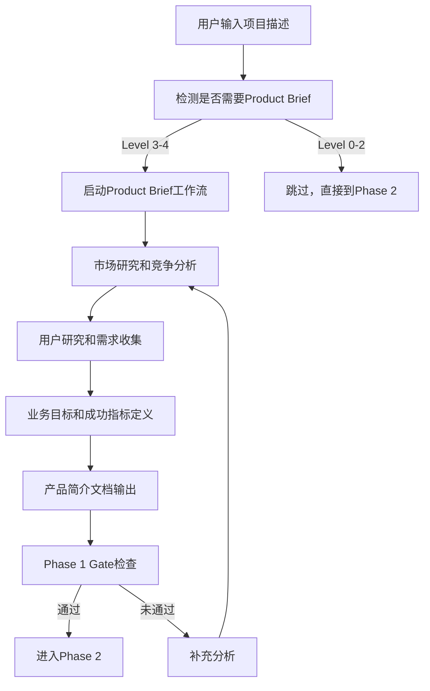

# Lifecycle Management 生命周期管理分析

## 概述

BMAD-METHOD采用四阶段生命周期管理，通过Scale-Adaptive系统实现了从简单bug修复到企业级系统开发的全覆盖。每个阶段都有明确的目标、输出和gate检查机制。

## 四阶段生命周期架构

### Phase 1: Analysis（分析阶段）

```yaml
目标: 理解问题域和业务需求
适用Level: 主要Level 3-4，Level 2可选
主要活动:
  - 问题定义和范围确定
  - 利益相关者识别
  - 市场和竞争分析
  - 用户研究和需求收集

关键输出:
  - product-brief.md (产品简介)
  - 用户研究报告
  - 竞争分析文档
  - 业务目标定义

Gate检查:
  ✅ 问题陈述清晰
  ✅ 目标用户明确
  ✅ 业务价值量化
  ✅ 约束条件识别
```

#### Product Brief工作流



### Phase 2: Planning Workflows（规划工作流阶段）

```yaml
目标: 定义解决方案和实施计划
适用Level: 所有Level，但文档深度不同
主要活动:
  - PRD创建 (Level 2+)
  - Tech Spec创建 (Level 0-1)
  - 需求优先级排序
  - 初步技术可行性评估

关键输出:
  Level 0-1: tech-spec.md
  Level 2+: prd.md (Product Requirements Document)

Gate检查:
  ✅ 功能需求明确
  ✅ 非功能需求定义
  ✅ 优先级排序完成
  ✅ 初步工作量估算
```

#### PRD创建工作流详解

```yaml
# PRD三模态工作流
Create Mode (创建模式):
  步骤序列:
    1. step-01-init: 工作流初始化
    2. step-02-discovery: 项目发现
    3. step-03-journeys: 用户旅程映射
    4. step-04-journeys: 深化用户旅程
    5. step-05-personas: 用户画像定义
    6. step-06-innovation: 创新机会识别
    7. step-07-features: 功能需求定义
    8. step-08-priorities: 优先级排序
    9. step-09-functional: 功能规格说明
    10. step-10-success: 成功指标定义
    11. step-11-complete: 完成和审核

Validate Mode (验证模式):
  目标: 验证现有PRD质量
  检查项: 完整性、一致性、可实施性

Edit Mode (编辑模式):
  目标: 改进现有PRD
  支持: 增量修改、版本控制
```

#### Level差异化规划

```yaml
Level 0 (Bug修复):
  文档: Quick Spec (1页)
  内容: 问题描述 + 解决方案 + 验收标准
  时间: 15-30分钟

Level 1 (小功能):
  文档: Tech Spec (2-5页)
  内容: 需求 + 技术方案 + 测试计划
  时间: 1-2小时

Level 2 (中型项目):
  文档: PRD (10-20页)
  内容: 用户需求 + 功能规格 + 成功指标
  时间: 1-2天

Level 3 (复杂系统):
  文档: PRD + Architecture (20-40页)
  内容: 完整需求 + 系统设计 + 实施计划
  时间: 3-5天

Level 4 (企业级):
  文档: PRD + Architecture + 策略文档 (40+页)
  内容: 战略规划 + 详细设计 + 治理框架
  时间: 1-2周
```

### Phase 3: Solutioning（解决方案阶段）

```yaml
目标: 设计技术架构和实施方案
适用Level: Level 2+需要，Level 3-4强制
主要活动:
  - 系统架构设计
  - 技术栈选择
  - Epics和User Stories分解
  - 实施准备度评估

关键输出:
  - architecture.md (系统架构)
  - epics-and-stories.md (史诗和用户故事)
  - technical-decisions.md (技术决策记录)
  - implementation-readiness.md (实施准备度报告)

Gate检查:
  ✅ 架构设计完整
  ✅ 技术决策有据可依
  ✅ Stories可实施
  ✅ 团队能力匹配
  ✅ 风险识别和缓解计划
```

#### Architecture工作流

```yaml
系统架构设计流程:
  1. 架构需求分析
     - 功能需求分析
     - 非功能需求分析 (性能、安全、可扩展性)
     - 约束条件识别

  2. 架构决策制定
     - 技术栈选择
     - 架构模式决策 (微服务 vs 单体)
     - 数据架构设计
     - 集成策略

  3. 架构文档编写
     - 系统概览
     - 组件设计
     - 数据流图
     - 部署架构

  4. 架构评审
     - 技术可行性评估
     - 性能影响分析
     - 安全风险评估
     - 运维复杂度评估
```

#### Epics & Stories分解

```yaml
分解原则:
  - Epic: 大功能模块 (1-2周完成)
  - Story: 独立可交付功能 (1-3天完成)
  - Task: 具体实施任务 (半天-1天完成)

示例分解 (电商评论系统):
  Epic 1: 评论管理系统
    Story 1.1: 用户发表评论
    Story 1.2: 评论编辑和删除
    Story 1.3: 评论审核工作流
    Story 1.4: 评论举报机制

  Epic 2: 评分功能
    Story 2.1: 星级评分系统
    Story 2.2: 评分统计展示
    Story 2.3: 评分趋势分析

验收标准:
  - 每个Story都有明确的验收标准
  - Story之间依赖关系清晰
  - 工作量估算合理
  - 优先级排序明确
```

#### Implementation Readiness检查

```yaml
准备度评估维度:
  📋 文档完整性:
    ✅ PRD已完成且经过审核
    ✅ 架构设计已完成 (Level 3+)
    ✅ Epics和Stories已定义
    ✅ 技术决策已记录

  🔧 技术准备度:
    ✅ 开发环境已搭建
    ✅ 依赖服务已确认
    ✅ 技术栈已验证
    ✅ 性能基线已建立

  👥 团队准备度:
    ✅ 团队成员技能匹配
    ✅ 角色分工明确
    ✅ 沟通机制建立
    ✅ 工具和流程就绪

  🎯 业务准备度:
    ✅ 利益相关者对齐
    ✅ 验收标准明确
    ✅ 发布计划确定
    ✅ 成功指标定义
```

### Phase 4: Implementation（实施阶段）

```yaml
目标: 执行开发和交付
适用Level: 所有Level
主要活动:
  - Sprint规划和执行
  - 代码开发和审查
  - 测试执行和质量保证
  - 持续集成和部署

关键输出:
  - 可工作的软件
  - 测试报告
  - 部署文档
  - 用户文档

Gate检查:
  ✅ 功能完整性验证
  ✅ 质量标准达成
  ✅ 性能指标满足
  ✅ 安全要求通过
  ✅ 用户验收测试通过
```

#### Dev Story工作流

```yaml
开发故事执行流程:
  1. Story选择和分析
     - 从Epic中选择Story
     - 分析技术实现方案
     - 识别依赖和风险

  2. 技术设计
     - API设计
     - 数据模型设计
     - 组件架构设计
     - 测试策略制定

  3. 实现指导
     - 代码结构建议
     - 最佳实践应用
     - 错误处理策略
     - 性能优化建议

  4. 质量保证
     - 代码审查检查清单
     - 单元测试覆盖率
     - 集成测试场景
     - 安全漏洞检查
```

#### Test Design工作流

```yaml
测试设计双模式:
  System-Level Mode (系统级 - Phase 3):
    目标: 整体可测试性评估
    输出: test-design-system.md
    内容:
      - 测试架构设计
      - 测试环境规划
      - 自动化测试策略
      - 质量门禁定义

  Epic-Level Mode (Epic级 - Phase 4):
    目标: 具体Epic的测试规划
    输出: test-design-epic-N.md
    内容:
      - 风险评估
      - 测试优先级
      - 覆盖率计划
      - 测试用例设计
```

#### Course Correction机制

```yaml
偏差检测和纠正:
  触发条件:
    - 进度显著偏离计划
    - 质量指标不达标
    - 需求发生重大变化
    - 技术风险实现

  纠正流程:
    1. 问题识别和分析
    2. 根因分析
    3. 影响评估
    4. 纠正方案制定
    5. 计划调整
    6. 利益相关者沟通

  输出文档:
    - 问题分析报告
    - 纠正行动计划
    - 更新的项目计划
    - 风险缓解措施
```

## 生命周期控制机制

### 1. Gate检查系统

```yaml
Gate检查原则:
  - 每个阶段结束都有明确的Gate
  - Gate检查基于可验证的标准
  - 不通过Gate不能进入下一阶段
  - 支持Gate检查的迭代改进

Gate检查实施:
  Phase 1 → Phase 2:
    ✅ 业务问题清晰
    ✅ 目标用户明确
    ✅ 成功标准定义

  Phase 2 → Phase 3:
    ✅ 需求文档完整
    ✅ 功能边界清晰
    ✅ 优先级排序完成

  Phase 3 → Phase 4:
    ✅ 架构设计完成
    ✅ Stories可实施
    ✅ 团队准备就绪

  Phase 4 → Release:
    ✅ 功能验证通过
    ✅ 质量标准达成
    ✅ 部署准备完成
```

### 2. 状态跟踪机制

```yaml
# 项目状态跟踪
project_status:
  current_phase: "Phase 3: Solutioning"
  current_level: 2
  progress:
    phase_1: "completed"
    phase_2: "completed"
    phase_3: "in_progress"
    phase_4: "not_started"

  completed_workflows:
    - "product-brief"
    - "prd"
    - "architecture"

  current_workflow: "epics-and-stories"

  next_milestones:
    - "implementation-readiness"
    - "dev-story"
```

### 3. 回溯和升级机制

```yaml
回溯机制:
  - 任何阶段都可以回到前面阶段补充文档
  - 保持版本控制和变更记录
  - 影响分析和传播

升级机制:
  Level升级路径:
    0 → 1: 添加tech-spec
    1 → 2: 添加PRD
    2 → 3: 添加architecture
    3 → 4: 扩展enterprise文档

  Phase内升级:
    - 同一Phase内可以添加更多工作流
    - 文档可以迭代改进
    - 质量可以持续提升
```

## 不同Level的生命周期差异

### Level 0: 单一原子变更

```yaml
简化生命周期:
  Phase 1: 跳过 (问题已知)
  Phase 2: Quick Spec (15分钟)
  Phase 3: 跳过 (无需架构)
  Phase 4: 直接实现

典型时间线: 30分钟 - 2小时
文档产出: quick-spec.md
```

### Level 1: 小功能

```yaml
轻量生命周期:
  Phase 1: 可选 (简单问题定义)
  Phase 2: Tech Spec (1-2小时)
  Phase 3: 可选 (简单设计)
  Phase 4: 开发实现

典型时间线: 半天 - 2天
文档产出: tech-spec.md, simple-design.md
```

### Level 2: 中型项目

```yaml
标准生命周期:
  Phase 1: 可选 (Product Brief)
  Phase 2: PRD (1-2天)
  Phase 3: 可选架构 + Epics (1-2天)
  Phase 4: Sprint实施 (1-4周)

典型时间线: 1-6周
文档产出: prd.md, epics-and-stories.md, [architecture.md]
```

### Level 3: 复杂系统

```yaml
完整生命周期:
  Phase 1: Product Brief (1-2天)
  Phase 2: 详细PRD (2-3天)
  Phase 3: 完整架构 + 详细Epics (3-5天)
  Phase 4: 多Sprint实施 (2-3月)

典型时间线: 3-6个月
文档产出: 完整文档套件
```

### Level 4: 企业级

```yaml
企业生命周期:
  Phase 1: 战略分析 (1-2周)
  Phase 2: 企业PRD (1周)
  Phase 3: 企业架构 + 治理 (2-3周)
  Phase 4: 多团队协作实施 (6-18月)

典型时间线: 6个月 - 2年
文档产出: 企业级文档体系
```

## 生命周期优势与价值

### 1. 结构化管理

**传统问题**: 项目缺乏清晰的阶段划分
**生命周期解决方案**: 四阶段清晰划分，每阶段有明确目标

### 2. 质量保证

**传统问题**: 质量控制缺乏系统性
**生命周期解决方案**: Gate检查确保每阶段质量达标

### 3. 风险控制

**传统问题**: 风险发现太晚，纠正成本高
**生命周期解决方案**: 早期发现，及时纠正

### 4. 可预测性

**传统问题**: 项目进度和质量难以预测
**生命周期解决方案**: 标准化流程提供可预测性

## 总结

BMAD-METHOD的生命周期管理通过四阶段结构化流程，结合Scale-Adaptive智能调节，实现了从简单到复杂项目的全覆盖。Gate检查机制确保质量，回溯和升级机制提供灵活性，Course Correction机制保证项目能够及时纠偏。这种设计既保证了项目的系统性和完整性，又避免了过度流程化的弊端。